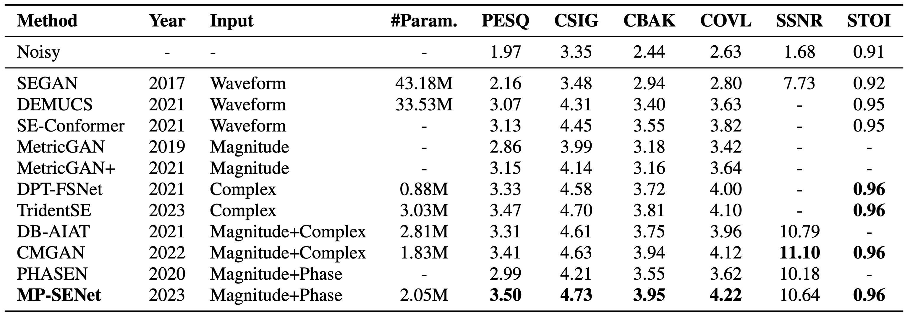

# MP-SENet: A Speech Enhancement Model with Parallel Denoising of Magnitude and Phase Spectra
### Ye-Xin Lu, Yang Ai, Zhen-Hua Ling
In our [paper](https://arxiv.org/abs/2305.13686), we proposed MP-SENet: a TF-domain monaural SE model with parallel magnitude and phase spectra denoising.<br>
We provide our implementation as open source in this repository.

**Abstract:** 
This paper proposes MP-SENet, a novel Speech Enhancement Network which directly denoises Magnitude and Phase spectra in parallel. The proposed MP-SENet adopts a codec architecture in which the encoder and decoder are bridged by convolution-augmented transformers. The encoder aims to encode time-frequency representations from the input noisy magnitude and phase spectra. The decoder is composed of parallel magnitude mask decoder and phase decoder, directly recovering clean magnitude spectra and clean-wrapped phase spectra by incorporating learnable sigmoid activation and parallel phase estimation architecture, respectively. Multi-level losses defined on magnitude spectra, phase spectra, short-time complex spectra, and time-domain waveforms are used to train the MP-SENet model jointly. Experimental results show that our proposed MP-SENet achieves a **PESQ of 3.50** on the public VoiceBank+DEMAND dataset and outperforms existing advanced SE methods.

Visit our [demo website](http://yxlu-0102.github.io/mpsenet-demo) for audio samples.

## Pre-requisites
1. Python >= 3.6.
2. Clone this repository.
3. Install python requirements. Please refer [requirements.txt](https://github.com/yxlu-0102/MP-SENet/blob/main/requirements.txt).
4. Download and extract the [VoiceBank+DEMAND dataset](https://datashare.ed.ac.uk/handle/10283/1942). Resample all wav files to 16kHz, and move the clean and noisy wavs to `VoiceBank+DEMAND/wavs_clean` and `VoiceBank+DEMAND/wavs_noisy`, respectively. 

## Training
```
python train.py --config config.json
```
Checkpoints and copy of the configuration file are saved in `cp_mpsenet` directory by default.<br>
You can change the path by adding `--checkpoint_path` option.

## Inference
```
python inference.py --checkpoint_file [generator checkpoint file path]
```
You can also use the pretrained best checkpoint file we provide in `best_ckpt/g_best`.<br>
Generated wav files are saved in `generated_files` by default.<br>
You can change the path by adding `--output_dir` option.

## Model Structure


## Comparison with other SE models


## Acknowledgements
We referred to [HiFiGAN](https://github.com/jik876/hifi-gan), [NSPP](https://github.com/YangAi520/NSPP) 
and [CMGAN](https://github.com/ruizhecao96/CMGAN) to implement this.
